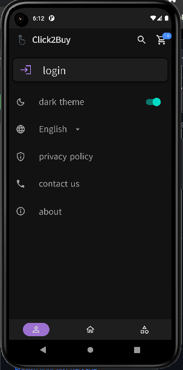
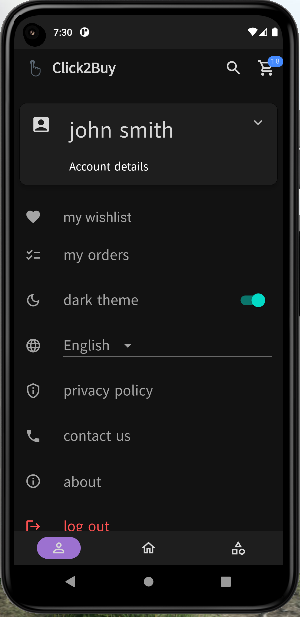

  
 
 
# project1
an E-commerce mobile app built using Flutter framework
here is [the backend and dashboard](https://github.com/ahed0programer/Click2Buy/tree/ahed) for this app.
this was a university group project that got an excellent 93% result

## about app
- a fully functional E-commerce mobile app for Android/IOS, specialized in selling all kinds of clothing
- the app is controlled by an admin via dashboard.
- product variants are supported (color, size, material), with special image for each variant.
- customers can make order, cancel or edit their order when available.
- customers can view their orders history with each order details and status.
- customers can view a product details, add a variant or more to cart, add the product to their wishlist and leave a review.
- customer can view and edit their cart or wishlist. 
- customers can login with their account, or as guest with limited functionality.
- OTP verification is supported for verifying account, and for password reset.
- api authentication and authorization is used to insure account security and functionality.
- products search with search history is supported, with the ability to filter by price, brand, rating, available colors, available sizes and 
  available materials.
- products categories can be navigated, each category might have multiple products and sub-categories.
- the app supports light and dark themes.
- the app supports Arabic and English languages.

## ScreenShots
 

 

 

 

 

 

 

check [this folder](demos) for more screenshots

